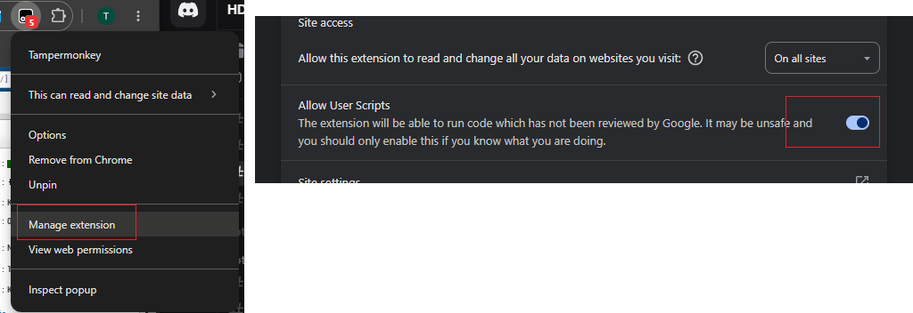
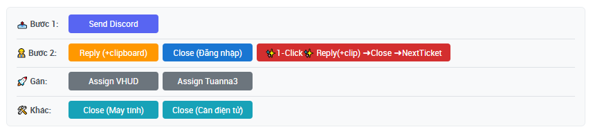

# 🛠️ Helpdesk Tools - Tampermonkey Script
---
## 📥 Cài đặt 
1. Cài extension [Tampermonkey](https://www.tampermonkey.net/) trên trình duyệt
2. Click vào link cài đặt trực tiếp:
   👉 **[Install Helpdesk Tools](https://github.com/voz261/crownx-hdmmmb-helpdesk-tools/raw/refs/heads/main/helpdesk-tools.user.js)**
3. Tampermonkey sẽ tự động nhận diện và hiện cửa sổ cài đặt

## Cài đặt Tampermonkey
Open Extension Management: Click the 3-dot menu, go to Extensions
Select Manage Extensions.
Allow User Scripts: On

---
## 📸 Giao diện

### 📤 Bước 1: Gửi thông tin
- **Send Discord**: Gửi nội dung ticket hiện tại lên Discord qua Webhook
### 👷 Bước 2: Xử lý ticket
| Nút | Chức năng | Mô tả |
|:---|:---|:---|
| **Reply (+clipboard)** | Trả lời ticket | Lấy nội dung đã Copy (Ctrl+C) và dán vào khung reply |
| **Close (Đăng nhập)** | Đóng ticket | Đóng ticket với category *"Dịch vụ Đăng nhập"* |
| **✨1-Click✨** | Reply + Close | Kết hợp cả 2 chức năng trên chỉ trong 1 click |

### 🚀 Gán ticket
- **Assign VHUD**: Gán ticket cho team VHUD ⚠ *Trường hợp đã reset nhưng acc bị khóa*
- **Assign Tuanna3**: Gán ticket cho Tuanna3 ⚠️ *Trường hợp tái tuyển/không tìm được ad*

### 🛠️ Các chức năng khác
- **Close (Máy tính)**: Đóng ticket với category *"Dịch vụ Máy tính"*
- **Close (Cân điện tử)**: Đóng ticket với category *"Hỗ trợ Cân"*
- **Close (Đường truyền)**: Đóng ticket với category *"Đường truyền"*
---

## 🔄 Cập nhật
### Tự động
Tampermonkey tự động kiểm tra và cập nhật script khi có version mới (mặc định mỗi ngày).
### Thủ công
1. Mở Tampermonkey → Dashboard
2. Click vào script **Helpdesk Tools**
3. Chọn **Check for updates**
---
## 👤 Tác giả Tuanna3